# Pipeline Upgrade Demonstration

This folder contains images demonstrating the upgrade of the application from **version 1.0.1** to **version 1.0.2** using the pipeline requested in the challenge.

---

## 📸 Pipeline Steps Overview

| Step | Images | Description |
|------|--------|-------------|
| 1    | <a href="01_status_helm_before_deploy_1.0.2_version.png">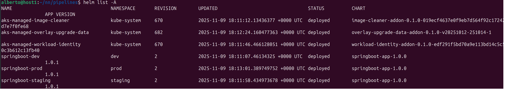</a>  <a href="03_registry_before_upgrade_app_1_0_2.png">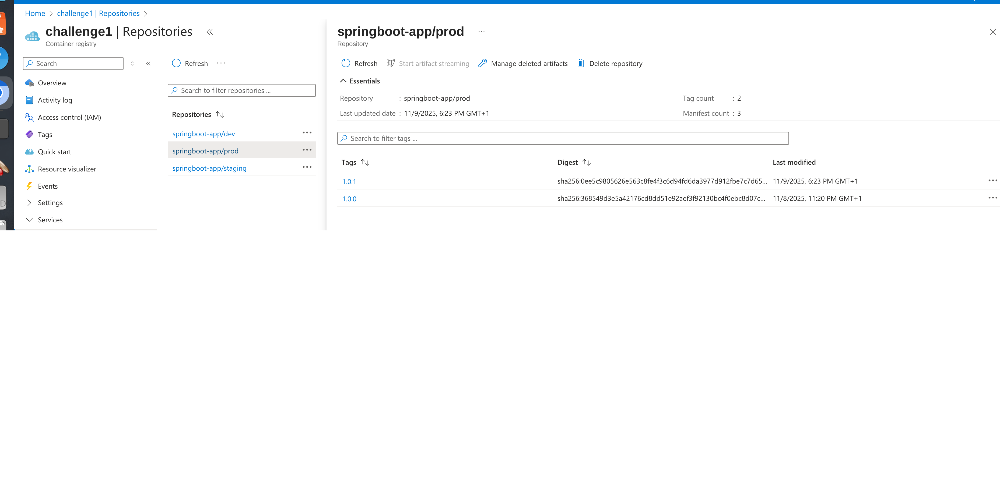</a> | **Current state** of the application before the upgrade. |
| 2    | <a href="04_pipeline_execution.png">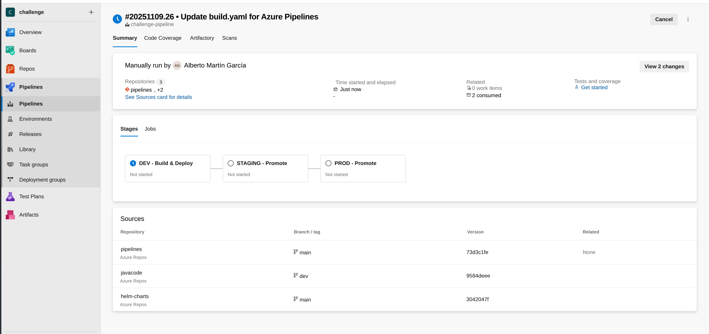</a>  | **Triggering compilation and deployment** in the **dev** environment. |
| 3    |  <a href="07_waiting_for_manual_approval_staging_2.png">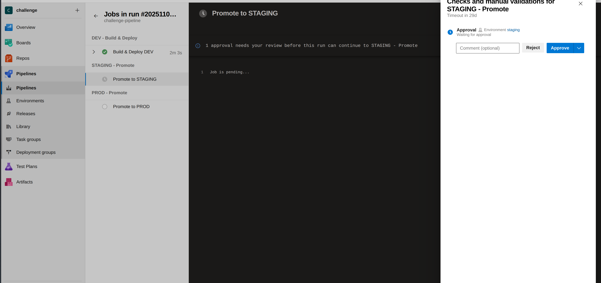</a>  | **Approval and deployment** in the **staging** environment. |
| 4    | <a href="09_waiting_for_manual_approval_prod_1.png">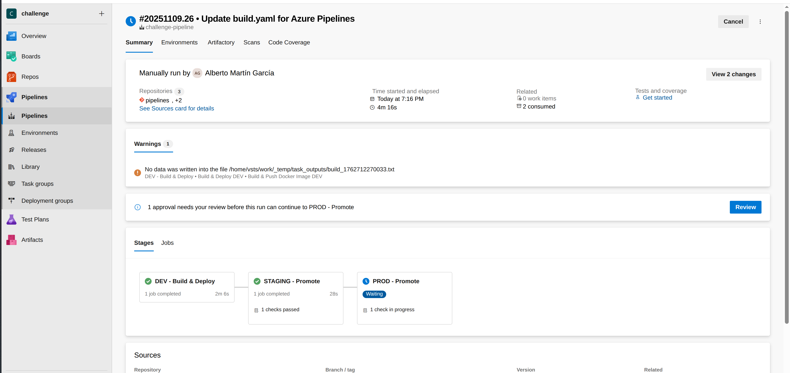</a> <a href="10_waiting_for_manual_approval_prod_2.png">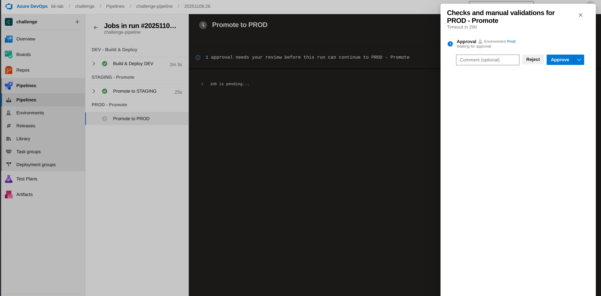</a> <a href="11_end_execution_stage_Prod.png">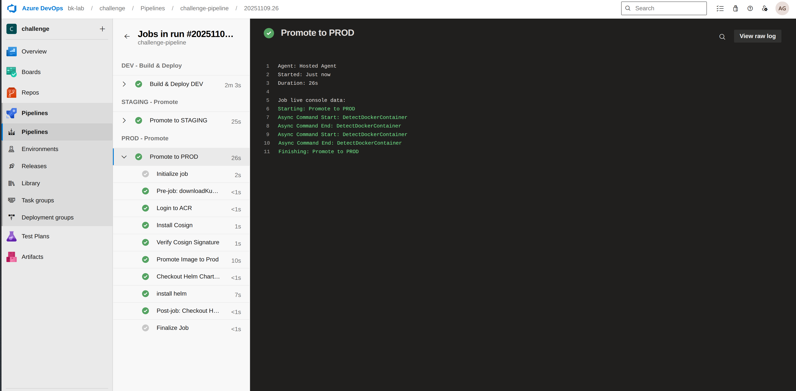</a> | **Approval and deployment** in the **prod** environment. |
| 5    | <a href="12_helms_after_upgrade_1.0.2.png">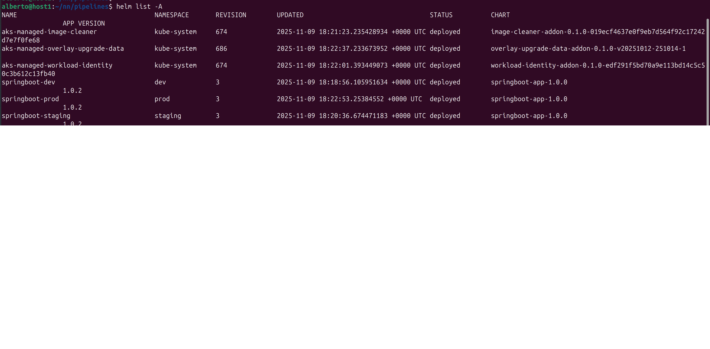</a> <a href="13_version_image_after_upgrade.png">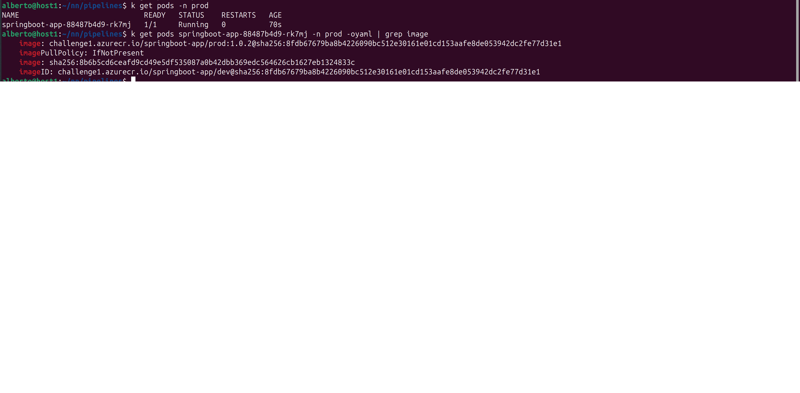</a>  <a href="15_service_running.png">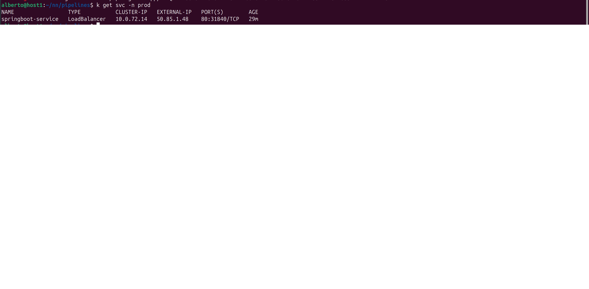</a> <a href="16_web_service_running.png">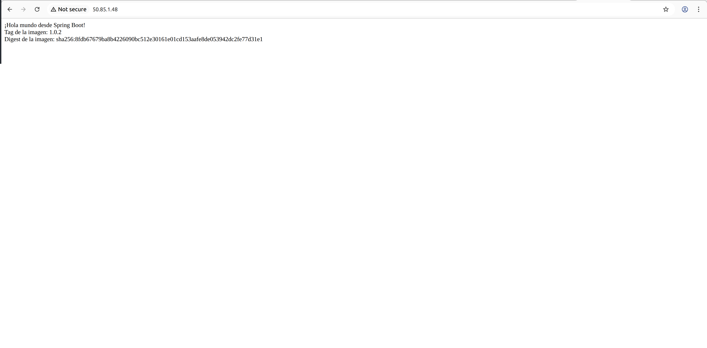</a> | **Verification** that version 1.0.2 has been successfully deployed and is running correctly. |

---

These images illustrate the complete **CI/CD workflow**, including:

- Automatic compilation and deployment steps  
- Manual approvals for staging and production environments  
- Verification of successful version upgrade

> ⚠️ Note: The image numbers correspond to the files in this folder.
