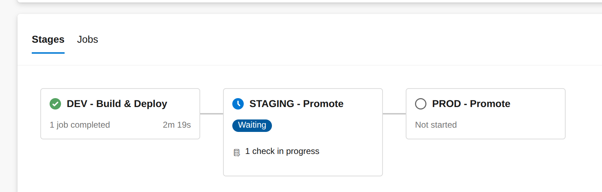

# CI/CD Pipeline Stages Overview

This document describes the different stages of the CI/CD pipeline for the Spring Boot application.

---

## Stage: Dev

- **Manual execution:** This stage does not have a trigger for every change in the Java code `dev` branch, and does not require approvals.  
- **Build:** Compiles the application.  
- **Docker Image:** Builds the Docker image and tags it with the application version.  
- **Security Checks:** Scans for critical security issues only in both the source code and the Docker image using **Trivy**.  
- **Image Signing:** Signs the image with a private key and stores the digest as metadata in the registry.  
- **Deployment:** Deploys to the **dev** namespace in the Kubernetes cluster using Helm, overriding:  
  - Application version  
  - Image tag  
  - Image digest  
  - Registry folder (`dev`, `staging`, or `prod`)

---

## Stage: Staging

- **Manual approval required** before execution.  
- **Signature Verification:** Checks the signature and digest of the image.  
- **Registry Management:** Moves the image from the `/dev` folder to the `/staging` folder in the registry.  
- **Deployment:** Deploys the Helm chart in the **staging** namespace.

---

## Stage: Prod

- **Manual approval required** before execution.  
- **Signature Verification:** Checks the signature and digest of the image.  
- **Registry Management:** Moves the image from the `/staging` folder to the `/prod` folder in the registry.  
- **Deployment:** Deploys the Helm chart in the **prod** namespace.

---

## Notes

- The Dev stage allows developers to test changes quickly without approvals.  
- Staging and Prod stages enforce manual approvals and image verification for security and reliability.  
- Helm charts are used in all stages to deploy the application with the exact version, tag, and digest.

---

## Pipeline Visualization

> **Pipeline Overview:** This diagram shows the complete CI/CD flow from Dev to Staging and Prod, including builds, security scans, signing, and deployment.

  

